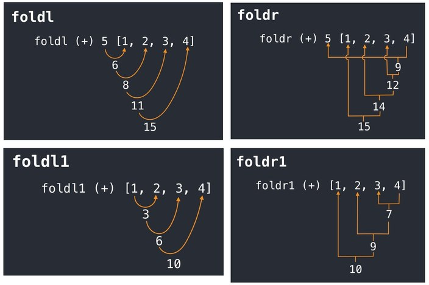

## Acerca del contenido
Realicé esta recopilación de material para aquellos estudiantes que necesiten entender más en detalle como desarrollar en Haskell integrando conceptos del paradigma funcional. En cada programa les dejo comentado su funcionamiento. Cabe destacar que también soy estudiante, y es posible que presenten posibles errores conceptuales.

También les comparto en formato pdf las guías de ejercicios, parciales y finales.

Si hacen uso de este material agradecería mencionar la fuente, ya que si algun experto en la materia encontrase posibles errores, podria aprender de ello y corregirlos.

 ## Conceptos generales
 
Los distintos tipos de Fold se pueden ver representados de la siguiente manera
